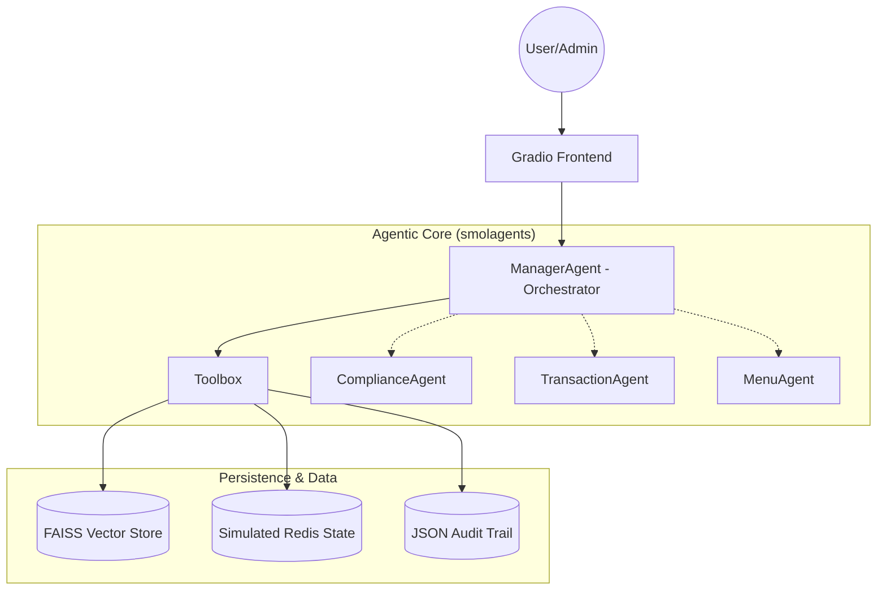

# 🍽️ GourmetAI: Autonomous Restaurant Platform

GourmetAI is a production-grade, multi-agent SaaS platform designed for autonomous restaurant operations. Built with `smolagents` and optimized for Hugging Face Free Tier, it features policy-governed orchestration, RAG-based compliance, and an enterprise-level audit trail.

## 🌟 Key Features

- **Hierarchical Orchestration**: A central `ManagerAgent` delegates tasks to specialized agents for Compliance, Transactions, and Menu management.
- **RAG-Enforced Guardrails**: Sensitive actions like refunds are only executed after a semantic lookup in the legal Terms & Conditions.
- **Unified SaaS Dashboard**: A multi-tab Gradio UI featuring Customer, Restaurant, and Super Admin views.
- **Enterprise Observability**: Every AI decision is logged with a reasoning trace, risk level, and policy citation.
- **Zero-Cost Deployment**: Optimized for Hugging Face Spaces using lightweight open-source models (Qwen-1.5B/0.5B).

## 🏗️ Architecture



## 🛠️ Tech Stack

- **Orchestration**: `smolagents` (Hugging Face)
- **Models**: `Qwen/Qwen2.5-1.5B-Instruct` (Manager), `Qwen/Qwen2.5-0.5B-Instruct` (Sub-agents)
- **UI**: `Gradio`
- **RAG**: `FAISS` + `sentence-transformers`
- **Data**: Local JSON simulated state (Redis-lite)

## 🚀 Quick Start

### 1. Prerequisites
- Python 3.10+
- (Optional but Recommended) Hugging Face Token for Inference API

### 2. Installation
```bash
git clone <repository-url>
cd RestaurantAI
pip install -r requirements.txt
```

### 3. Initialize RAG
Ingest the menu and platform policies into the vector store:
```bash
python init_rag.py
```

### 4. Run the Platform
```bash
python app.py
```

## 🧪 Verification
Run the reasoning-focused verification suite:
```bash
python verify_system.py
```

## 🛡️ Governance & Compliance
This system implements **Reasoning-Driven Guardrails**. The AI cannot unilaterally approve a refund; it MUST call the `ComplianceAgent`, which performs a RAG query against the T&C. The `ManagerAgent` then uses the output of that tool call to decide whether to proceed with the `TransactionAgent`.

## 📈 Scalability Roadmap
- **Phase 1**: Human-in-the-loop feedback loops via the Super Admin dashboard.
- **Phase 2**: Migration to Pinecone (Vector) and Upstash (Redis) for global distribution.
- **Phase 3**: Integration with real-world payment gateways.

---
*Created for the Venture-Backed AI SaaS Investor Demo.*
